# 🚀 Nearby Boost

<div align="center">


### High-Speed, Zero-Cloud Local Network File Transfer for Android & Windows

[](https://developer.android.com)
[](https://dotnet.microsoft.com)
[](https://kotlinlang.org)
[](https://dotnet.microsoft.com)
[](LICENSE)

*Blazing-fast, private, and peer-to-peer file sharing between your Android devices and Windows PCs over Wi-Fi or Hotspot.*

</div>

---

## 🌟 Overview

**Nearby Boost** is a dual-platform file transfer solution engineered for speed, privacy, and simplicity. It allows seamless two-way file and folder transfers between Android smartphones/tablets and Windows desktop/laptop PCs directly over local Wi-Fi or mobile hotspot.

- ⚡ **Pure Local Gigabit Speed:** Maximize your Wi-Fi router or hotspot bandwidth (reaching 50–100+ MB/s depending on your network card and 5GHz/Wi-Fi 6 router).
- 🔒 **100% Private & Offline:** Zero cloud dependencies, zero external servers, and zero data telemetry. Your files never touch the internet.
- 📂 **Full Directory & Multi-File Parallelism:** Transfer entire directory structures or thousands of files simultaneously with up to 4 concurrent streaming connections.
- 🛡️ **Mutual Trust & Pairing:** Explicit permission prompt with device identity verification (device ID, friendly name, and avatar index).
- 🔋 **Android Background Service:** Long-running transfers stay active without interruption using `TransferForegroundService` with Wi-Fi and CPU WakeLocks.
- 🖥️ **Dual Windows Clients:** A modern WPF GUI client with drag-and-drop and real-time speed meters, plus an ultra-lightweight CLI tool for power users and automation scripts.

---

## 📁 Repository Structure

```text
NearbyBoost/
├── app/                              # Android Application (Kotlin, Material 3)
│   ├── src/main/
│   │   ├── AndroidManifest.xml       # Permissions & Foreground Service config
│   │   ├── java/com/example/nearbyboost/
│   │   │   ├── MainActivity.kt       # Main UI controller & client logic
│   │   │   ├── TransferServer.kt     # High-throughput TCP receiver server
│   │   │   ├── TransferForegroundService.kt # Background notification & wakelock service
│   │   │   ├── Discovery.kt          # UDP broadcast discovery engine
│   │   │   ├── NetworkUtils.kt       # IP & Wi-Fi interface utilities
│   │   │   ├── AvatarCatalog.kt      # Device avatar system
│   │   │   └── FileTypeBadge.kt      # File icon & category helper
│   │   └── res/                      # Material 3 layouts, drawables, themes
│   └── build.gradle.kts              # Android build configuration
│
├── WindowsSenderGui/                 # Windows WPF Desktop Application (.NET 8)
│   ├── MainWindow.xaml               # Modern Dark UI (Transfer, Devices, History, Settings)
│   ├── MainWindow.xaml.cs            # WPF code-behind, drag-and-drop, transfer engine
│   ├── Discovery.cs                  # UDP LAN device scanner
│   ├── DeviceInfo.cs                 # Device models & paired state
│   ├── KnownDevices.cs               # Persistence for trusted pairings
│   ├── HistoryStore.cs               # Transfer log store
│   ├── FileProgressVM.cs             # Real-time data rate & ETA ViewModel
│   ├── app.ico                       # Embedded multi-resolution application icon
│   └── WindowsSenderGui.csproj       # WPF project configuration
│
├── WindowsSender/                    # Windows CLI Headless Tool (.NET 8)
│   ├── Program.cs                    # High-speed console transfer client & receiver
│   ├── app.ico                       # Executable icon
│   └── WindowsSender.csproj          # Console project configuration
│
├── gradle/                           # Gradle wrapper & version catalogs
├── build.gradle.kts                  # Root Gradle configuration
├── settings.gradle.kts               # Gradle project declaration
└── .github/workflows/build.yml       # GitHub Actions CI build verification
```

---

## ⚡ Network Protocol Architecture

Nearby Boost uses a dedicated, lightweight binary protocol designed for raw network throughput without protocol overhead:

```mermaid
sequenceDiagram
    autonumber
    participant Client as Sender (Windows / Android)
    participant Receiver as Receiver (Android / Windows)

    Note over Client,Receiver: Step 1: UDP LAN Discovery (Port 52526)
    Client->>Receiver: Broadcast UDP "NEARBYBOOST_DISCOVER"
    Receiver-->>Client: Reply UDP "NEARBYBOOST_HERE|<DeviceId>|<DeviceName>|<TcpPort>"

    Note over Client,Receiver: Step 2: TCP Handshake & Authorization (Port 52525)
    Client->>Receiver: Connect TCP Socket
    Client->>Receiver: Send Header: [Batch / File Meta] + [Sender Identity]
    Receiver-->>Client: Prompt User -> Return [Accept / Reject Byte] + [Receiver Identity]

    Note over Client,Receiver: Step 3: High-Speed Parallel Streaming
    rect rgb(20, 30, 45)
    Client->>Receiver: Stream 1 (1 MB Chunks)
    Client->>Receiver: Stream 2 (1 MB Chunks)
    Client->>Receiver: Stream 3 (1 MB Chunks)
    Client->>Receiver: Stream 4 (1 MB Chunks)
    end
    Client->>Receiver: Close Socket on Transfer Complete
```



### 1. UDP Discovery (Port 52526)
- **Request:** UDP broadcast packet with string `NEARBYBOOST_DISCOVER`.
- **Response:** `NEARBYBOOST_HERE|<deviceId>|<deviceName>|<tcpPort>`.
- Allows instant detection of nearby devices without manual IP entry.

### 2. TCP Transfer (Port 52525)
All integers are encoded in network byte order (big-endian):
- **Single File (Type 0):**
  `[Int32 nameLen][UTF8 filename][Int64 fileSize][Int32 senderIdLen][senderId][Int32 senderNameLen][senderName]`
- **Batch Announcement (Type 2):**
  `[Int32 batchNameLen][UTF8 batchName][Int32 fileCount][Int64 totalBytes][Int32 senderIdLen][senderId][Int32 senderNameLen][senderName]`
- **Response Byte:** `0x01` (Accept) or `0x00` (Reject).
- **Chunk Size:** 1 MB (`1 << 20` bytes) for maximum TCP window throughput.

---

## 📱 Android App Features

- **Material You / Material 3 Design:** Sleek UI adapting to system dark/light modes.
- **MediaStore Scoped Storage:** Saves incoming photos, videos, and music directly into their respective system media libraries (DCIM, Pictures, Music, Movies) and general files into `Download/NearbyBoost`.
- **Foreground Service (`TransferForegroundService`):** Ensures transfers finish even if you lock your screen or switch to another app.
- **Lock Management:** Automatically holds `PARTIAL_WAKE_LOCK` and `WIFI_MODE_FULL_HIGH_PERF` to prevent the device OS from throttling CPU or Wi-Fi speeds during transfers.
- **Device Management & Avatars:** Pair with trusted Windows machines and customize your local device persona.

### Requirements:
- Android 10 (API Level 29) or higher.
- Both devices connected to the same Wi-Fi network or Wi-Fi Hotspot.

---

## 🖥️ Windows GUI App Features

- **Drag & Drop:** Drag files or entire folders right onto the window to begin transfer.
- **Transfer Radar:** Scans your local subnet for active Nearby Boost receivers with a single click.
- **Live Performance Dashboard:**
  - Dynamic transfer rate (`MB/s`)
  - Transferred bytes vs total size
  - Percentage progress bar
  - Estimated time remaining (ETA)
- **Transfer History:** Persistent record of past transfers with open-folder shortcuts.
- **Customizable Identity:** Set custom computer names and avatar styles.

---

## 💻 Windows CLI Tool (`WindowsSender`)

For power users, automated server scripts, or quick command-line transfers:

```powershell
# Scan for active receivers on the network
dotnet run --project WindowsSender -- scan

# Send files or folders directly
dotnet run --project WindowsSender -- <Receiver-IP> 52525 "C:\Path\To\File.zip" "C:\Path\To\Folder"

# Run in receive mode (saves to Downloads\NearbyBoost)
dotnet run --project WindowsSender -- receive 52525 "C:\MyReceivedFiles"

# Interactive menu mode
dotnet run --project WindowsSender
```

---

## 🛠️ Build and Setup Instructions

### 1. Prerequisites
- **For Android:**
  - [Android Studio Iguana+](https://developer.android.com/studio) or command-line SDK tools.
  - JDK 17+.
- **For Windows:**
  - [.NET 8.0 SDK](https://dotnet.microsoft.com/download/dotnet/8.0).
  - Windows 10/11.

---

### 2. Building the Android Application

#### Using Gradle CLI:
```bash
# Windows
gradlew.bat assembleDebug

# Linux / macOS
chmod +x gradlew
./gradlew assembleDebug
```
The output debug APK will be generated at:
`app/build/outputs/apk/debug/app-debug.apk`

#### Using Android Studio:
1. Open Android Studio.
2. Select **Open an Existing Project** and choose the `NearbyBoost` folder.
3. Allow Gradle sync to complete.
4. Click **Run** (`Shift + F10`) or select **Build > Build Bundle(s) / APK(s) > Build APK(s)**.

---

### 3. Building the Windows Applications

#### Build the GUI Client:
```powershell
cd WindowsSenderGui
dotnet build -c Release
```
Executable output: `WindowsSenderGui/bin/Release/net8.0-windows/NearbyBoostSenderGui.exe`

#### Run the GUI Client:
```powershell
dotnet run --project WindowsSenderGui
```

#### Build the CLI Client:
```powershell
cd WindowsSender
dotnet build -c Release
```
Executable output: `WindowsSender/bin/Release/net8.0/NearbyBoostSender.exe`

---

## 🔧 Firewall & Networking Tips

Since Nearby Boost uses direct socket connections over the local LAN:
- **TCP Port 52525:** Used for high-speed file transfer streams.
- **UDP Port 52526:** Used for local device discovery broadcasts.

If devices cannot discover each other:
1. Ensure both devices are on the **same Wi-Fi network** or that one device is connected to the other's **Mobile Hotspot**.
2. If Windows Defender Firewall prompts you when running the PC app, ensure you check **"Allow on Private Networks"**.
3. Verify that your Wi-Fi router does not have **"AP Isolation"** or **"Client Isolation"** enabled (which prevents local devices from talking directly to each other).

---

## 🤝 Contributing

Contributions are warmly welcome!
1. Fork the repository.
2. Create a feature branch: `git checkout -b feature/MyFeature`.
3. Commit your changes: `git commit -m "Add MyFeature"`.
4. Push to branch: `git push origin feature/MyFeature`.
5. Open a Pull Request.

---

## 📄 License

This project is licensed under the MIT License - see the [LICENSE](LICENSE) file for details.
